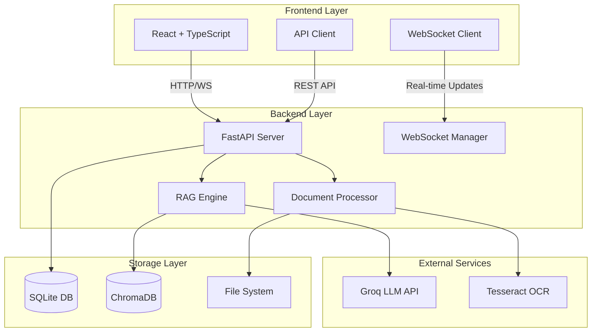
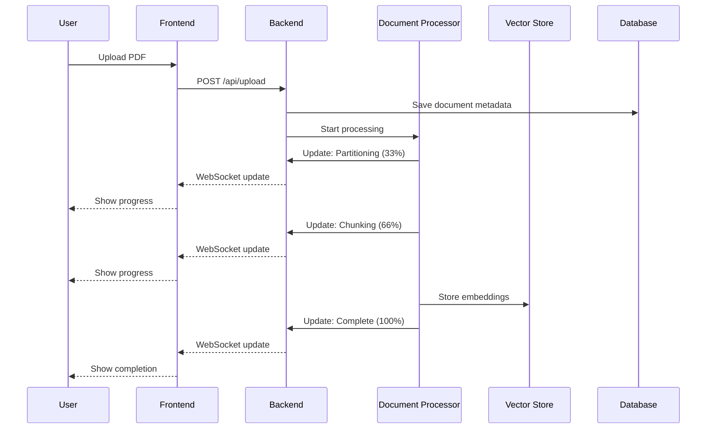
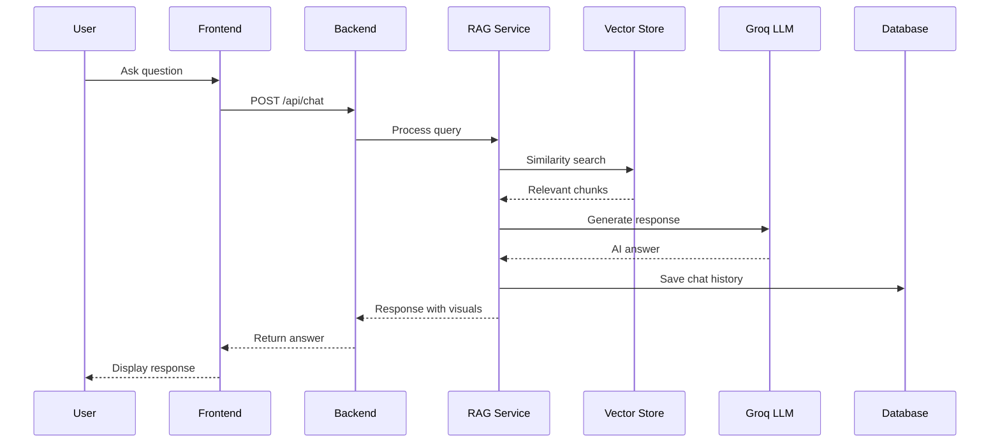

<div align="center">

# 🚀 Multi-Modal RAG System

### Intelligent Document Analysis with AI-Powered Conversational Interface

[](https://www.python.org/downloads/)
[](https://fastapi.tiangolo.com/)
[](https://reactjs.org/)
[](https://www.typescriptlang.org/)
[](LICENSE)

[Features](#-features) • [Demo](#-demo) • [Quick Start](#-quick-start) • [Architecture](#-architecture) • [Documentation](#-documentation)

</div>

---

## 📖 Overview

A production-ready, full-stack Multi-Modal Retrieval-Augmented Generation (RAG) system that enables intelligent conversations with PDF documents. Extract and analyze text, tables, and images with real-time processing updates and context-aware AI responses.

### 🎯 Key Highlights

- **Multi-Modal Processing**: Extracts text, tables, and images from PDFs
- **Real-Time Updates**: WebSocket-based live progress tracking
- **Conversational AI**: Context-aware responses with chat history
- **Session Management**: Multi-user support with isolated vector stores
- **Modern UI**: Beautiful, responsive interface with smooth animations
- **Production-Ready**: Comprehensive error handling, logging, and validation

---

## ✨ Features

### 📄 Document Processing
- Upload and process PDF documents
- Extract text, tables, and images
- Intelligent document partitioning and chunking
- Real-time progress tracking via WebSocket

### 💬 Conversational Chat
- Context-aware AI responses using Groq LLM
- Chat history persistence
- Visual display of relevant tables and images
- Chunk-based retrieval with transparency

### 🎨 User Interface
- Clean, modern design with Tailwind CSS
- Responsive layout for all devices
- Smooth animations and transitions
- Real-time status indicators

### 🔐 Security & Management
- Session-based user isolation
- File validation and size limits
- CORS configuration
- Clear history and cleanup options

---

## 🎬 Demo

### Upload & Processing
```
┌─────────────────────────────────────────────────────────┐
│  📤 Upload Document                                      │
│  ┌─────────────────────────────────────────────────┐   │
│  │  Drag & drop PDF or click to browse             │   │
│  │  [📄 sample.pdf] ✓ Uploaded                     │   │
│  └─────────────────────────────────────────────────┘   │
│                                                          │
│  ⚡ Processing Status:                                  │
│  ✓ Partitioning document... (100%)                     │
│  ✓ Chunking content... (100%)                          │
│  ✓ Vectorizing chunks... (100%)                        │
│  ✓ Processing complete!                                │
└─────────────────────────────────────────────────────────┘
```

### Chat Interface
```
┌─────────────────────────────────────────────────────────┐
│  💬 Chat with Your Document                             │
│  ┌─────────────────────────────────────────────────┐   │
│  │  👤 What is this document about?                │   │
│  │                                                  │   │
│  │  🤖 This document discusses...                  │   │
│  │     [📊 Table 1] [🖼️ Image 1]                   │   │
│  │     📄 Used 3 document chunks                   │   │
│  └─────────────────────────────────────────────────┘   │
│  ┌─────────────────────────────────────────────────┐   │
│  │  Ask a question... [Send]                       │   │
│  └─────────────────────────────────────────────────┘   │
└─────────────────────────────────────────────────────────┘
```

---

## 🏗️ Architecture

### System Architecture



### Data Flow

```
┌──────────────┐
│ User uploads │
│     PDF      │
└──────┬───────┘
       │
       ▼
┌──────────────────────────────────────────────────┐
│ Backend Processing Pipeline                      │
│                                                   │
│  1. File Validation & Storage                    │
│  2. Document Partitioning (Unstructured.io)      │
│  3. Text/Table/Image Extraction                  │
│  4. Content Chunking (LangChain)                 │
│  5. Embedding Generation (Sentence Transformers) │
│  6. Vector Storage (ChromaDB)                    │
└──────┬───────────────────────────────────────────┘
       │
       ▼
┌──────────────────────────────────────────────────┐
│ Chat Query Processing                            │
│                                                   │
│  1. Query Embedding                              │
│  2. Similarity Search (ChromaDB)                 │
│  3. Context Retrieval                            │
│  4. LLM Generation (Groq)                        │
│  5. Response with Visuals                        │
└──────┬───────────────────────────────────────────┘
       │
       ▼
┌──────────────┐
│ User receives│
│   response   │
└──────────────┘
```

---

## 💻 Tech Stack

### Backend
| Technology | Purpose | Version |
|------------|---------|---------|
| **Python** | Core Language | 3.10+ |
| **FastAPI** | Web Framework | 0.104+ |
| **LangChain** | RAG Framework | Latest |
| **ChromaDB** | Vector Database | Latest |
| **SQLAlchemy** | ORM | 2.0+ |
| **Unstructured** | Document Parsing | Latest |
| **Sentence Transformers** | Embeddings | Latest |
| **Groq** | LLM API | Latest |
| **Tesseract OCR** | Image Text Extraction | 5.0+ |
| **Poppler** | PDF Processing | Latest |

### Frontend
| Technology | Purpose | Version |
|------------|---------|---------|
| **React** | UI Library | 18.2+ |
| **TypeScript** | Type Safety | 5.0+ |
| **Vite** | Build Tool | 5.0+ |
| **Tailwind CSS** | Styling | 3.4+ |
| **Lucide React** | Icons | Latest |
| **Axios** | HTTP Client | Latest |

---

## 📁 Project Structure

```
multi-modal-rag/
│
├── backend/                          # Python FastAPI Backend
│   ├── app/
│   │   ├── api/                      # API Routes
│   │   │   ├── __init__.py
│   │   │   ├── upload.py            # Document upload endpoints
│   │   │   ├── chat.py              # Chat endpoints
│   │   │   ├── documents.py         # Document management
│   │   │   └── websocket.py         # WebSocket connections
│   │   │
│   │   ├── services/                 # Business Logic
│   │   │   ├── __init__.py
│   │   │   ├── document_processor.py # Document processing pipeline
│   │   │   ├── rag_service.py       # RAG operations
│   │   │   ├── vector_store.py      # ChromaDB operations
│   │   │   └── websocket_manager.py # WebSocket management
│   │   │
│   │   ├── utils/                    # Utilities
│   │   │   ├── __init__.py
│   │   │   ├── file_utils.py        # File operations
│   │   │   ├── image_utils.py       # Image processing
│   │   │   └── validators.py        # Input validation
│   │   │
│   │   ├── config.py                 # Configuration management
│   │   ├── database.py               # Database setup
│   │   ├── models.py                 # SQLAlchemy models
│   │   ├── schemas.py                # Pydantic schemas
│   │   └── main.py                   # FastAPI application
│   │
│   ├── tests/                        # Backend tests
│   ├── requirements.txt              # Python dependencies
│   ├── .env.example                  # Environment template
│   └── vercel.json                   # Vercel deployment config
│
├── frontend/                         # React TypeScript Frontend
│   ├── src/
│   │   ├── components/               # React Components
│   │   │   ├── Upload/
│   │   │   │   ├── UploadSection.tsx
│   │   │   │   └── FileUploader.tsx
│   │   │   ├── Chat/
│   │   │   │   ├── ChatInterface.tsx
│   │   │   │   └── MessageBubble.tsx
│   │   │   └── Display/
│   │   │       ├── ProcessingDisplay.tsx
│   │   │       └── VisualContent.tsx
│   │   │
│   │   ├── hooks/                    # Custom React Hooks
│   │   │   ├── useWebSocket.ts      # WebSocket connection
│   │   │   ├── useChat.ts           # Chat management
│   │   │   └── useUpload.ts         # Upload handling
│   │   │
│   │   ├── services/                 # API Services
│   │   │   └── api.ts               # API client
│   │   │
│   │   ├── styles/                   # Styling
│   │   │   └── index.css            # Global styles
│   │   │
│   │   ├── types/                    # TypeScript Types
│   │   │   └── index.ts             # Type definitions
│   │   │
│   │   ├── App.tsx                   # Main App component
│   │   └── main.tsx                  # Entry point
│   │
│   ├── public/                       # Static assets
│   ├── package.json                  # Node dependencies
│   ├── tsconfig.json                 # TypeScript config
│   ├── vite.config.ts               # Vite config
│   ├── tailwind.config.js           # Tailwind config
│   ├── .env.example                 # Environment template
│   └── vercel.json                  # Vercel deployment config
│
├── .gitignore                        # Git ignore rules
├── LICENSE                           # MIT License
└── README.md                         # This file
```

---

## 🚀 Quick Start

### Prerequisites

Before you begin, ensure you have the following installed:

- **Python 3.10+** - [Download](https://www.python.org/downloads/)
- **Node.js 18+** - [Download](https://nodejs.org/)
- **Tesseract OCR** - [Installation Guide](https://github.com/tesseract-ocr/tesseract)
- **Poppler** - [Installation Guide](https://poppler.freedesktop.org/)
- **Groq API Key** - [Get API Key](https://console.groq.com/)

### Installation

#### 1️⃣ Clone the Repository

```bash
git clone https://github.com/yourusername/multi-modal-rag.git
cd multi-modal-rag
```

#### 2️⃣ Backend Setup

```bash
# Navigate to backend directory
cd backend

# Create virtual environment
python -m venv venv

# Activate virtual environment
# On Windows:
venv\Scripts\activate
# On macOS/Linux:
source venv/bin/activate

# Install dependencies
pip install -r requirements.txt

# Create environment file
cp .env.example .env

# Edit .env and add your configuration
# Required: GROQ_API_KEY, TESSERACT_PATH, POPPLER_PATH
```

**Backend `.env` Configuration:**

```env
# Required
GROQ_API_KEY=your_groq_api_key_here

# Database
DATABASE_URL=sqlite:///./rag_app.db

# File Storage
MAX_FILE_SIZE=10485760  # 10MB
UPLOAD_DIR=./uploads

# ChromaDB
CHROMA_PERSIST_DIR=./chroma_data

# System Dependencies (adjust paths for your system)
TESSERACT_PATH=C:\Program Files\Tesseract-OCR
POPPLER_PATH=C:\Program Files\poppler\poppler-25.12.0\Library\bin

# CORS
ALLOWED_ORIGINS=["http://localhost:5173","http://localhost:3000"]

# Debug
DEBUG=False
```

**Start Backend Server:**

```bash
python -m app.main
```

✅ Backend running at: `http://localhost:8000`  
📚 API Docs: `http://localhost:8000/docs`

#### 3️⃣ Frontend Setup

```bash
# Navigate to frontend directory (from project root)
cd frontend

# Install dependencies
npm install

# Create environment file
cp .env.example .env

# Edit .env with your backend URL
```

**Frontend `.env` Configuration:**

```env
VITE_API_URL=http://localhost:8000/api
VITE_WS_URL=ws://localhost:8000/api
```

**Start Frontend Server:**

```bash
npm run dev
```

✅ Frontend running at: `http://localhost:5173`

#### 4️⃣ Access the Application

Open your browser and navigate to:
```
http://localhost:5173
```

---

## 🐳 Docker Deployment

### Quick Start with Docker

**Prerequisites**: Docker Desktop installed

```bash
# 1. Clone and navigate to project
git clone https://github.com/yourusername/multi-modal-rag.git
cd multi-modal-rag

# 2. Create .env file
cp .env.example .env
# Edit .env and add your GROQ_API_KEY

# 3. Build and run with Docker Compose
docker-compose up --build

# Access the application
# Frontend: http://localhost
# Backend: http://localhost:8000
# API Docs: http://localhost:8000/docs
```

### Docker Deployment Options

| Platform | Docker Support | Best For |
|----------|---------------|----------|
| **Railway** | ✅ Auto-detects Dockerfile | Full-stack apps (Recommended) |
| **Render** | ✅ Native Docker support | Production deployments |
| **Fly.io** | ✅ Docker-first platform | Global deployment |
| **Vercel** | ❌ No Docker support | Frontend only |

**See [DOCKER_DEPLOYMENT.md](DOCKER_DEPLOYMENT.md) for detailed instructions**

---

## 🔄 Workflow

### Document Processing Pipeline



### Chat Query Flow



---

## 🔧 Configuration

### Environment Variables Reference

#### Backend Variables

| Variable | Description | Default | Required |
|----------|-------------|---------|----------|
| `GROQ_API_KEY` | Groq API key for LLM | - | ✅ |
| `DATABASE_URL` | SQLite database path | `sqlite:///./rag_app.db` | ❌ |
| `MAX_FILE_SIZE` | Max upload size (bytes) | `10485760` | ❌ |
| `UPLOAD_DIR` | Upload directory | `./uploads` | ❌ |
| `CHROMA_PERSIST_DIR` | ChromaDB directory | `./chroma_data` | ❌ |
| `TESSERACT_PATH` | Tesseract OCR path | System default | ✅ |
| `POPPLER_PATH` | Poppler utils path | System default | ✅ |
| `ALLOWED_ORIGINS` | CORS origins | `["*"]` | ❌ |
| `DEBUG` | Debug mode | `False` | ❌ |

#### Frontend Variables

| Variable | Description | Default | Required |
|----------|-------------|---------|----------|
| `VITE_API_URL` | Backend API URL | `http://localhost:8000/api` | ✅ |
| `VITE_WS_URL` | WebSocket URL | `ws://localhost:8000/api` | ✅ |

---


